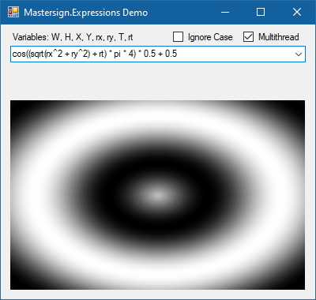

# Mastersign.Expressions

> A parser and compiler for a small EXCEL like expression language inside your .NET applications.

_Mastersign.Expression_ is a small DSL (domain specific language) – a little like the MS EXCEL formular language.
Its purpose is to provide a simple expression language
with a set of predefined functions for math and string manipulation.
Expressions are parsed via a parser, based on the [Sprache](https://github.com/sprache) parser framework,
and compiled via System.Linq.Expressions into a lambda delegate, and can therefore,
used repeatedly with acceptable performance.

Eine deutsche Version der Projektbeschreibung befindet sich auf der Mastersign-Homepage
(A german version of the project description can be found on the homepage of mastersign):
<https://www.mastersign.de/expressions>

See the [docs](docs/README.md) for more usage examples and reference documentation.

## Installation from Nuget

[](https://www.nuget.org/packages/Mastersign.Expressions/)

```sh
dotnet add package Mastersign.Expressions
```

## Features

_Mastersign.Expression_ supports numeric, boolean and string literals,
operators for numeric operations, string concatenation, logical combination and comparison.
Grouping is done with parantheses. Function calls have a C-style-syntax.
Functions, variables, constants, and parameters are provided via an evaluation context,
which can be easily extended by the developer.

It comes with a set of predefined functions for math, string manipulation and regular expressions.
For detailed description, see [Packages](docs/Packages.md).

The evaluation context can be configured to ignore the case of operator keywords,
literal keywords, variables, parameters, and function names.
The quote style for strings can be configured too.

## Expression Examples

* `1 + 2`
* `pi * (100f + 32.0/a)`
* `"\tName: " & name`
* `"result = " & (sin(pi * 2.0 + x) / 10)`

For a detailed description of the expression language syntax see [Expression Syntax](docs/Expression%20Syntax.md).

## Simple Usage Scenario

```csharp
using System;
using Mastersign.Expressions;

static class Program
{
    static void Main()
    {
        // create the evaluation context for the expression
        var context = new EvaluationContext();
        // set language options
        context.Options = LanguageOptions.Create(ignoreCase: true);
        // load the default packages with functions and constants (math, string, ...)
        context.LoadAllPackages();
        // add a custom variable
        context.SetVariable("x", 4);
        // add a custom function
        context.AddFunction<double, double>("neg", v => -v);
        // set parameter list
        context.SetParameters(new ParameterInfo("a", typeof(int)));
        // compile the expression into a lamda delegate
        var fun = context.CompileExpression<int, double>("SIN(PI * NEG(10 + x)) + a");
        // call the delegate and write the result to the console
        Console.WriteLine(fun(50));
    }
}
```

For more examples see [Examples](docs/Example.md).

## Screenshot of the Demo Application

Generation of a gray-scale bitmap with an expression:



Error reporting during parsing and compilation:


## License

This project is published under the MIT license.

Copyright &copy; by Tobias Kiertscher <dev@mastersign.de>
