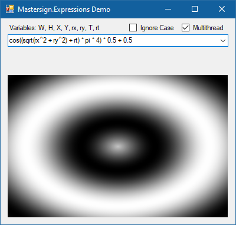

# Project Description

* [Features](#features)
* [Expression Example](#expression-example)
* [Simple Usage Scenario](#simple-usage-scenario)
* [Demo](#demo)

_Mastersign.Expression_ is a small DSL (domain specific language) a little like the MS EXCEL formular language. The purpose is to provide a simple expression language with a set of predefined functions for math and string manipulation. Expressions are parsed via a parser, based on the [Sprache](https://github.com/sprache) parser framework, and compiled via System.Linq.Expressions into a lambda delegate and can therefore used repeatedly with acceptable performance.

Eine deutsche Version der Projektbeschreibung befindet sich auf der Projektwebsite (A german version of the project description can be found on the project website): <http://www.mastersign.de/expressions>

## Features

It supports numeric, boolean and string literals, operators for numeric operations, string concatenation, logical combination and comparison. Grouping is done with parantheses. Function calls have a C-style-syntax. Functions, variables, constants, and parameters are provided via an evaluation context, which can be easily extended by the developer.

Mastersign.Expressions comes with a set of predefined functions for math, string manipulation and regular expressions. For detailed description, see [Packages](Packages.md).

## Expression Examples

* `1 + 2`
* `pi * (100f + 32.0/a)`
* `"\tName: " & name`
* `"result = " & (sin(pi * 2.0 + x) / 10)`

For a detailed description of expression language syntax see [Expression Syntax](Expression%20Syntax.md).

## Simple Usage Scenario

```csharp
using System;
using de.mastersign.expressions;
static class Program
{
    static void Main()
    {
        // create the evaluation context for the expression
        var context = new EvaluationContext();
        // load the default packages with functions and constants (math, string, ...)
        context.LoadAllPackages();
        // add a custom variable
        context.SetVariable("x", 4);
        // add a custom function
        context.AddFunction("neg", (Func<double, double>)(v => -v));
        // set parameter list
        context.SetParameters(new ParameterInfo("a", typeof(int)));
        // compile the expression into a lamda delegate
        var function = context.CompileExpression<int>("sin(pi * neg(10 + x)) + a");
        // call the delegate and write the result to the console
        Console.WriteLine(function(50));
    }
}
```

## Screenshot of the Demo Application


